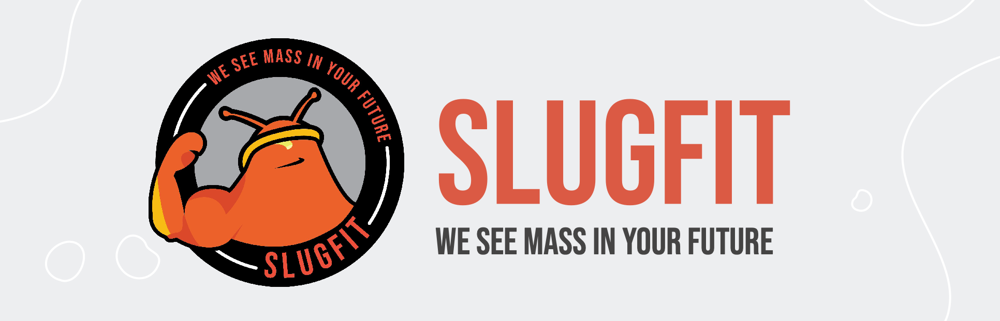

# SlugFit - Plan Workouts

A simple cross platform (IOS and Android) app made with React Native.

## Environment Setup

1. Install Node
   https://nodejs.org/en/download/
2. Install Yarn
   https://classic.yarnpkg.com/lang/en/docs/install/

## App Installation

1. Clone this repository
2. Set githooks with `git config core.hooksPath ./.githooks`
3. Navigate to the root of the repository and run `yarn` which will install all the dependencies
4. Running `yarn start` will begin the development server
5. If you have XCode installed and an iPhone simulator, you can press `i` which will open the simulator and run the app.
   Otherwise, you have to install the Expo Go app on your phone and scan the QR code from the terminal with your camera
   to run the app on your phone in Expo Go. Make sure your phone and laptop are connected to the same wifi network to use the latter option.

## Commands

- `yarn start` to begin the development server
- `yarn ios` to run IOS simulator
- `yarn android` to run Android simulator

- `yarn lint` to lint code
- `yarn lint:fix` to fix simple linting errors
- `yarn format` to format code according to style guide

- `yarn test` to run unit tests

## Screenshots

### Authentication

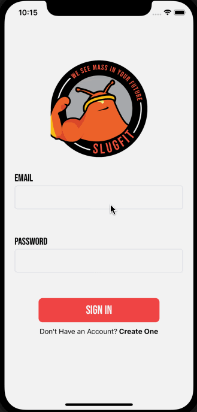

### Create Workouts

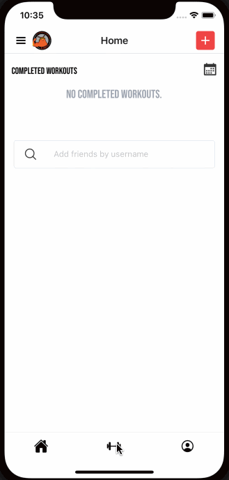
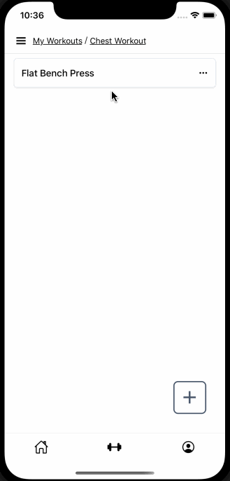
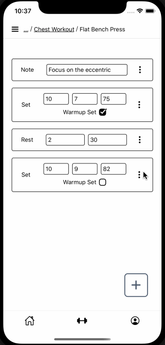
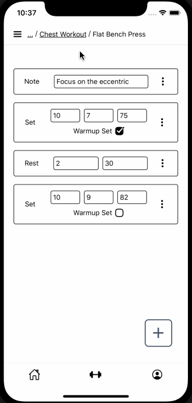

### Use Workouts

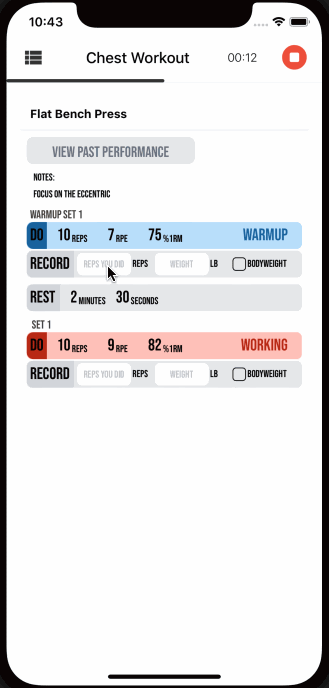
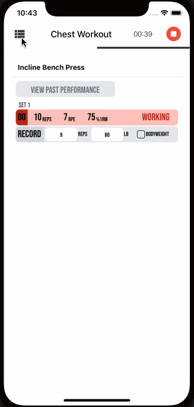
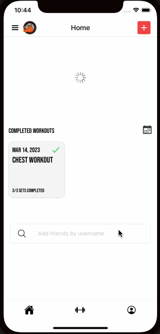

### Profile & Analytics

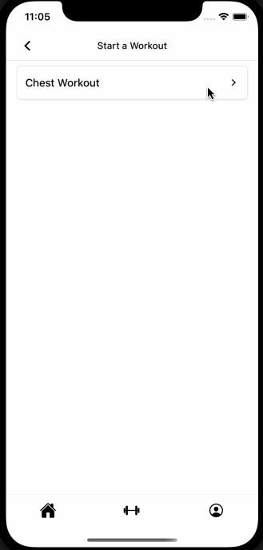
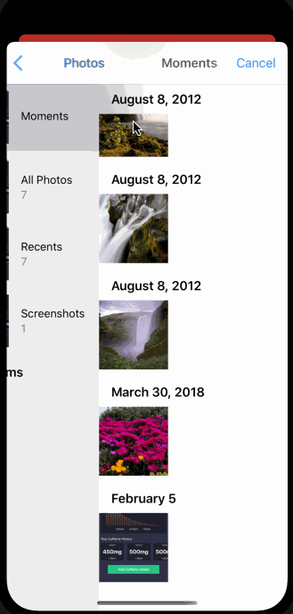
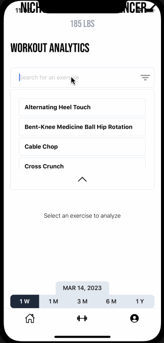
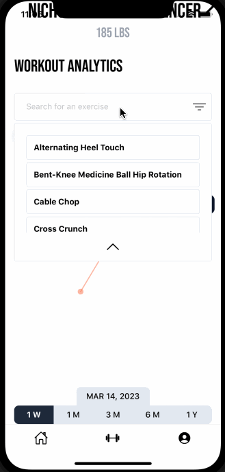

### Navigation & Error Handling

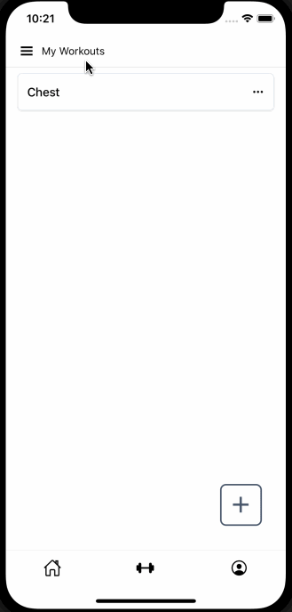
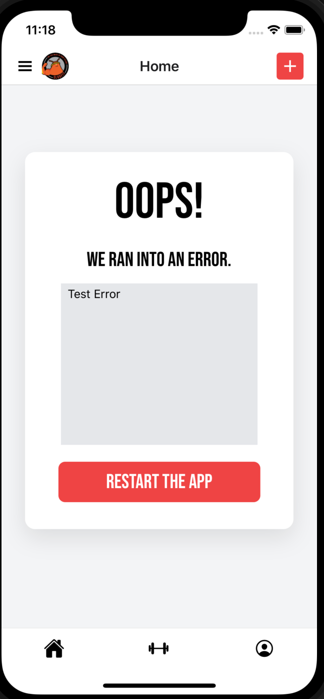

### Social Sharing

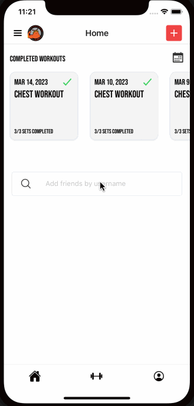
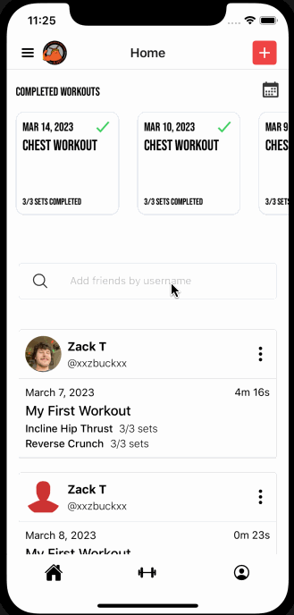
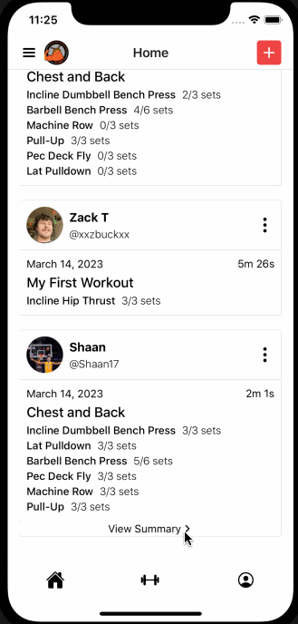
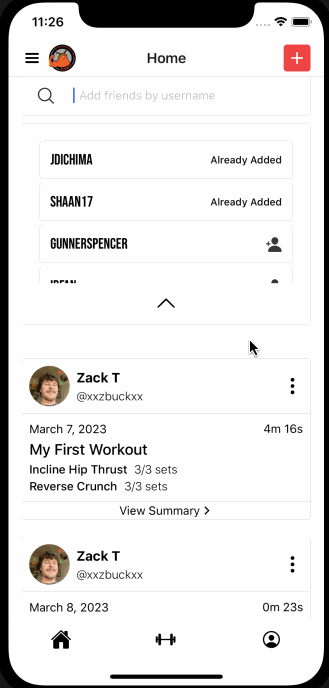
